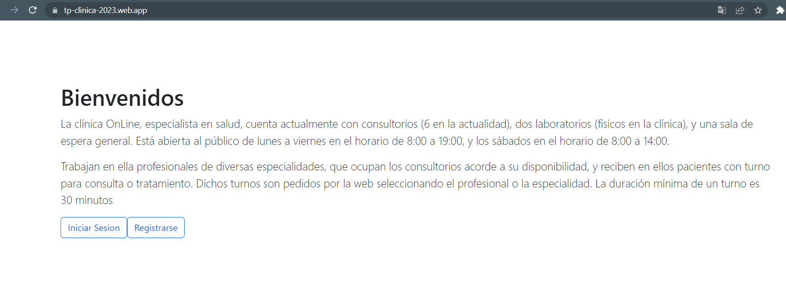
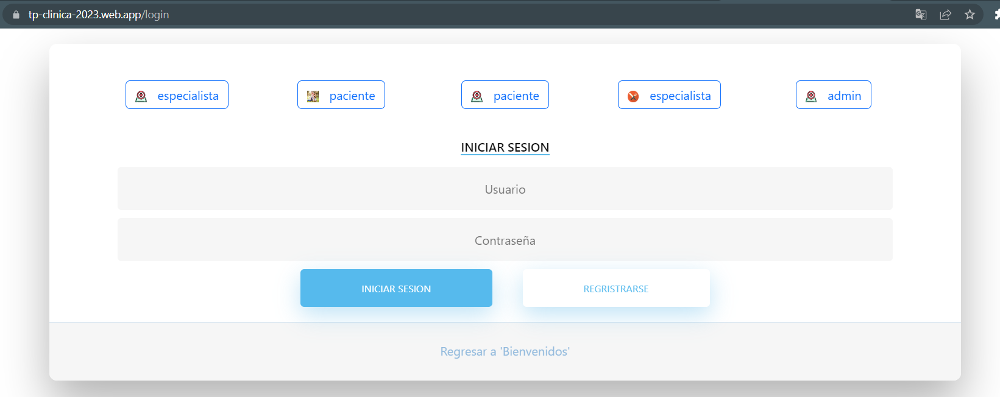
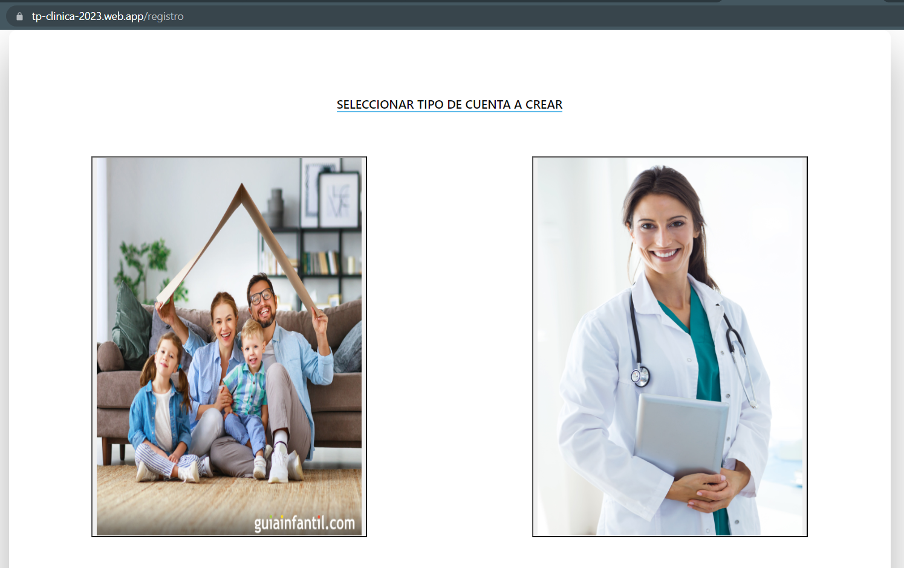
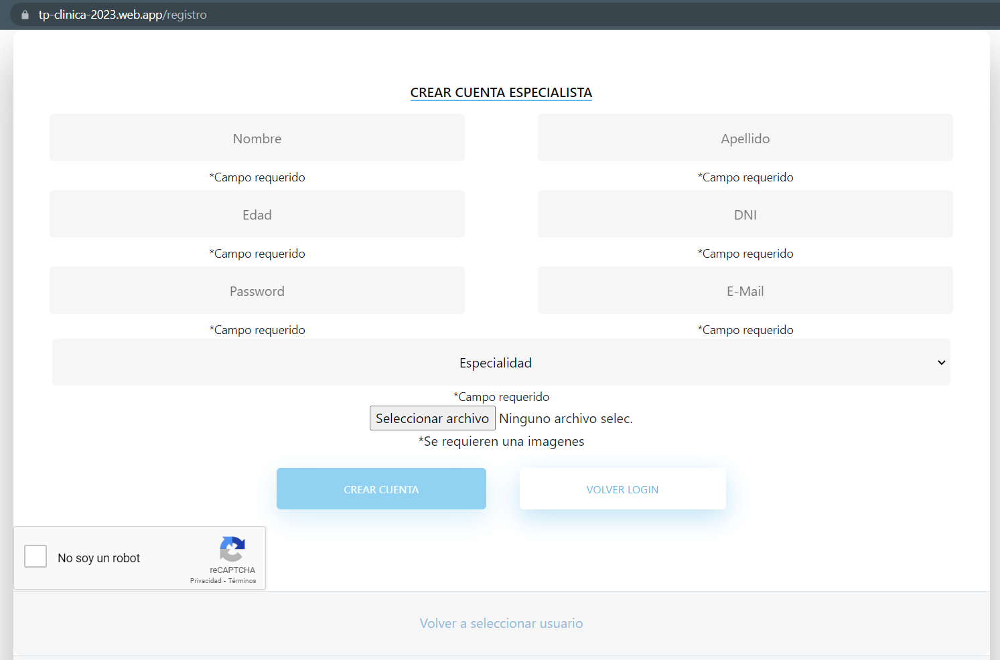
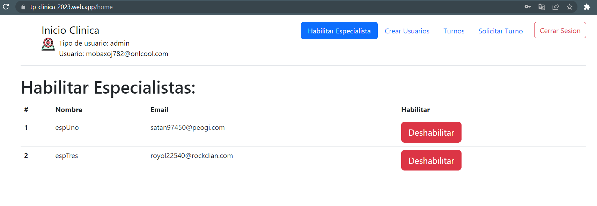
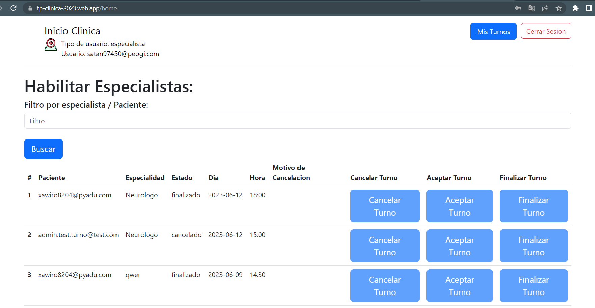
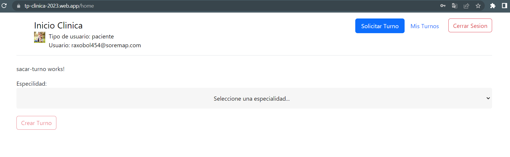

# TP Clinica

## Alumno

De La Cuadra, Marcos

#

# Descripcion

La clinica Online es una plataforma que le permite tanto a pacientes como especialistas poder gestionar turnos medicos.

#
# Funcionalidades por usuario

## Usuario Administrador
- Puede ver todos los turnos en la aplicaicon y cancelarlos
- Puede crear usuarios de tipo administrador/paciente/especialista
- Puede hablitar/deshabilitar especialistas
- Puede solicitar turnos para un paciente no registrado

## Usuario Especialista

- Puede ver todos los turnos asignados a el mismo
- - Puede cancelar el turno
- - Puede aceptar el turno
- - Puede finalizar un turno aceptado

## Usuario Paciente

- Puede solicitar un turno
- Puede ver todos los turnos asignados a el mismo
- - Puede cancelar el turno

#

# Acceso a la aplicacion

- [URL para ingresar a la aplicacion TP Clinica](https://tp-clinica-2023.web.app/)

# Paginas

### Pagina Bienvenidos

### Pagina Login

### Pagina Seleccion de usuario a crear

### Pagina Formulario de registro

### Pagina Principal Administrador

### Pagina Principal Especialista

### Pagina Principal Paciente

